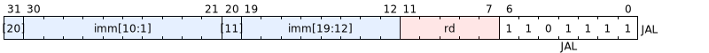
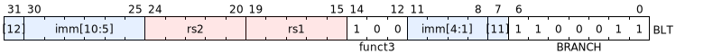
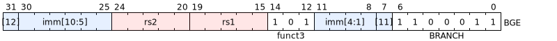
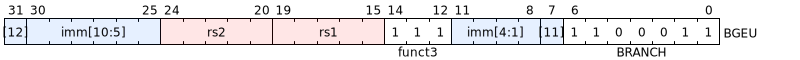
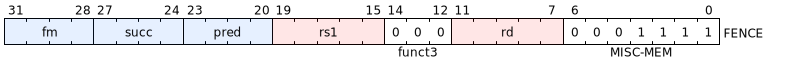

Montreal
========
:revnumber: 0.1.0-draft

A RISC-V RV32E processor designed for TinyTapeout.

RV32E
-----

https://docs.riscv.org/reference/isa/unpriv/unpriv-index.html[ISA Reference]

Reduces number of integer registers to 16 general-purpose registers
(x0-x15). Upper 16 registers consume around one quarter of the total
area of the core excluding memories, thus their removal saves around 25%
core area with a corresponding core power reduction.

Each register is 32 bits wide.

[cols="1,2,4", options="header"]
|===

| Register
| Description
| Purpose

| x0
| dedicated zero
| Source operand for value 0.

| x1
| return address
| Written by JAL/JALR. Holds address to be returned to once a function returns.
Must be saved to stack before calling another function.

| x2
| stack pointer
| Always points to top of the stack in RAM. Decremented to allocate space,
incremented to free it. CALLEE must restore it BEFORE returning.

| x3
| global pointer
|

| x4
| thread pointer
|

| x5
| alternate link reg
| Second link register for nested JAL sequences. Caller must save
if needed across a call.

| x6
| general scratch reg
|

| x7
| general scratch reg
|

| x8
| frame pointer
|

| x9
| saved register
|

| x10
| first function argument
| Also used to return integer results from function.

| x11
| second function argument
|

| x12
| third function argument
|

| x13
| fourth function argument
|

| x14
| fifth function argument
|

| x15
| sixth function argument
|

| pc
| program counter
| Address of current instruction

|===

Instruction Set
---------------

.Relevant opcodes for the IP. `inst[1:0] = 11`.
[cols="2*^1m,8*^2m", hrows=2]
|===

|
|
8+^| inst[4:2]

|
|
| 000
| 001
| 010
| 011
| 100
| 101
| 110
| 111

1.4+.^| inst[6:5]
| 00
| LOAD
|
|
| MISC-MEM
| OP-IMM
| AUIPC
|
|

| 01
| STORE
|
|
|
| OP
| LUI
|
|

| 10
|
|
|
|
|
|
|
|

| 11
| BRANCH
| JALR
|
| JAL
| SYSTEM
|
|
|
|===

=== Immediate Types

The labels `[7]`, `[20]`, and `[31]` represent the bits `inst[7]`, `inst[20]`, and `inst[31]`, respectively.

=== LUI

=== AUIPC

=== OP-IMM

=== OP

=== JAL

=== JALR

=== BRANCH

The labels `[11]` and `[12]` represent the bits `imm[11]` and `imm[12]` respectively.

=== LOAD

=== STORE

=== MISC-MEM

=== SYSTEM

